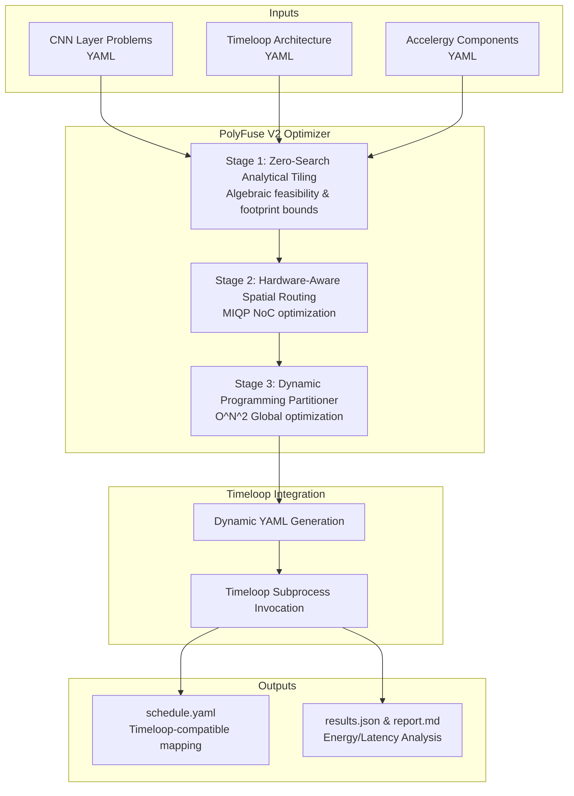
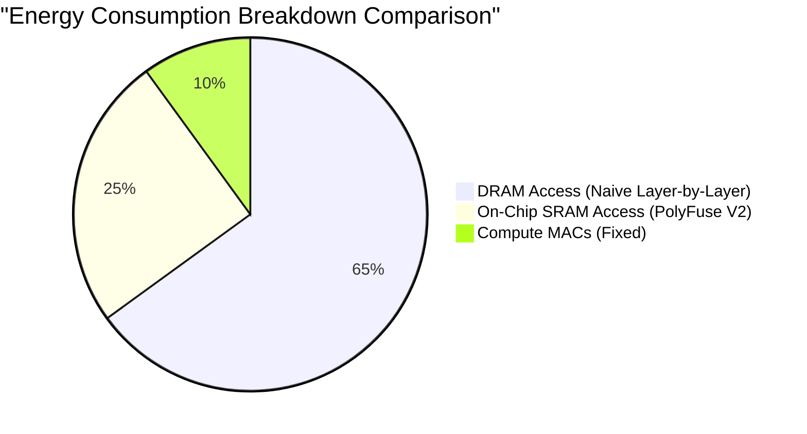

# PolyFuse V2: Analytical CNN Layer Fusion Optimizer

PolyFuse V2 is a standalone, end-to-end analytical CNN layer fusion optimizer for spatial accelerators. By keeping intermediate feature maps on-chip between consecutive CNN layers, it aggressively minimizes off-chip DRAM access, which is often the dominant source of energy consumption and latency in Deep Neural Network (DNN) hardware acceleration.

Unlike naive layer-by-layer execution or greedy fuse-all heuristics, PolyFuse V2 intelligently determines the *globally optimal* partitioning of a sequence of CNN layers into fused execution blocks to minimize a target objective (Energy, Latency, or Energy-Delay Product).

---

## 🚀 Features

- **Zero-Search Analytical Tiling**: Computes mathematically optimal tile sizes using a polyhedral recurrence formula, completely avoiding iterative simulation searches.
- **Hardware-Aware Spatial Routing (MIQP)**: Maps valid layer stacks spatially across NoC processing elements while ensuring data causality, minimizing physical NoC hop distances.
- **Dynamic Programming (DP) Partitioning**: Finds the globally optimal partition of a full linear layer chain into fused stacks without falling into greedy suboptimal traps.
- **Timeloop & Accelergy Integration**: Seamlessly interfaces with standard accelerator evaluation tools for final verification.

---

## 📊 Architecture and Workflow

PolyFuse V2 employs a three-stage core architecture to navigate the massive search space of layer fusion mathematically.



### Stage 1: Zero-Search Algebraic Tiling
Propagates required input footprints backward from the output tile dimension using the exact polyhedral recurrence. It guarantees perfect mathematical nesting across multi-level memory hierarchies and strictly enforces per-buffer hardware capacity limits as algebraic inequalities.

### Stage 2: Hardware-Aware Spatial Routing
Minimizes physical NoC hop distances using a convex squared-distance objective and extreme vector causality bounds. It eliminates the need for dummy binary variables, drastically speeding up optimization.

### Stage 3: Dynamic Programming Partitioning
Evaluates every possible sub-sequence of layers, scoring them based on base hardware cost and spatial routing penalties, ultimately minimizing the desired objective: `energy`, `latency`, or `edp` (Energy-Delay Product).

---

## 💻 Usage

PolyFuse V2 acts as a single command-line tool.

```bash
polyfuse \
  --arch /path/to/arch.yaml \
  --components /path/to/components/ \
  --network /path/to/layers/ \
  --output /path/to/output/ \
  --objective energy \
  --verbose
```

**Inputs:**
- `--arch`: Defines the full memory hierarchy, PE array dimensions, and NoC topology.
- `--components`: Defines energy-per-action tables for every hardware primitive.
- `--network`: A directory of layer YAMLs defining the convolution dimensions.

**Outputs:**
- `schedule.yaml` — The optimal fused-layer mapping.
- `report.md` — Human-readable report with partitioning tables and energy breakdowns.
- `results.json` — Machine-readable structural results.

---

## 📈 Comparisons vs Baselines

PolyFuse V2 dramatically outperforms generic approaches by avoiding common pitfalls such as buffer collisions and receptive field truncation.



1. **Naive Baseline (Layer-by-Layer):** Writes all intermediate activations to DRAM. PolyFuse V2 eliminates this off-chip intermediate traffic.
2. **Greedy Fuse-All Baseline:** Attempts to fuse all layers, often causing Global Buffer overflow on deeper networks. PolyFuse V2 breaks the fusion chain at mathematically optimal boundaries.

---

## 📁 Repository Structure

- `polyfuse/` - Core Python package for the PolyFuse V2 optimizer.
- `docs/` - Documentation, explanations, presentations, and the master plan.
- `tests/` - Automated unit and regression test suite.
- `scripts/` - Assorted helper scripts for testing, patching, and benchmarking.
- `results/` - Cached benchmark runs, JSON outputs, and comprehensive reports.
- `legacy/` - Archived versions and old source files (e.g. PolyFuse V1, pluto).

---

## 📚 Citations & Acknowledgments

This project relies on and is inspired by fundamental research in spatial accelerator evaluation and compiler optimization:

1. **Timeloop**: Parashar, A., et al. "Timeloop: A Systematic Approach to DNN Accelerator Evaluation." *ISPASS*, 2019.
2. **Accelergy**: Wu, Y., et al. "Accelergy: An Architecture-Level Energy Estimation Methodology for Accelerator Designs." *ICCAD*, 2019.
3. **DeepFrack**: PolyFuse V2 compares its methodologies against greedy heuristics which are commonly encountered when evaluating exhaustive layer fusion frameworks.

*For extensive implementation details, see [docs/PolyFuseV2_Explanation.md](docs/PolyFuseV2_Explanation.md).*
