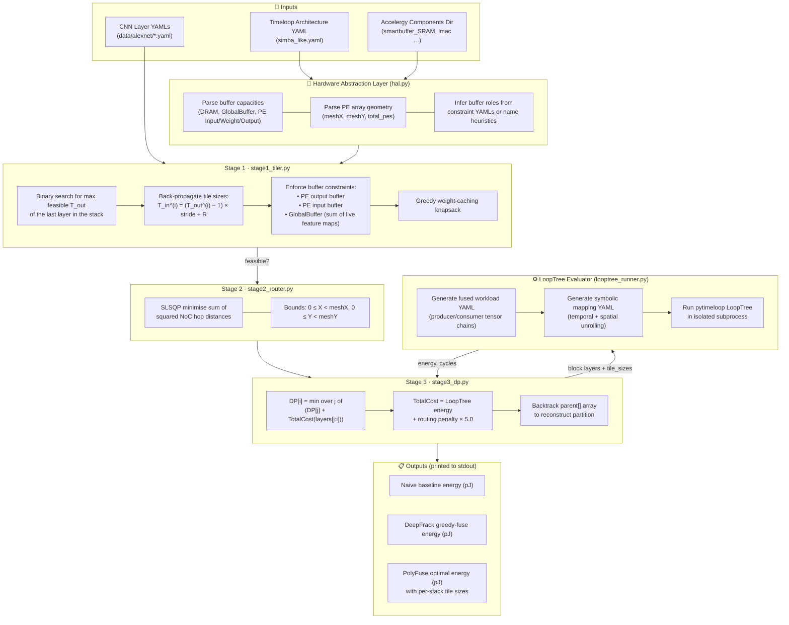
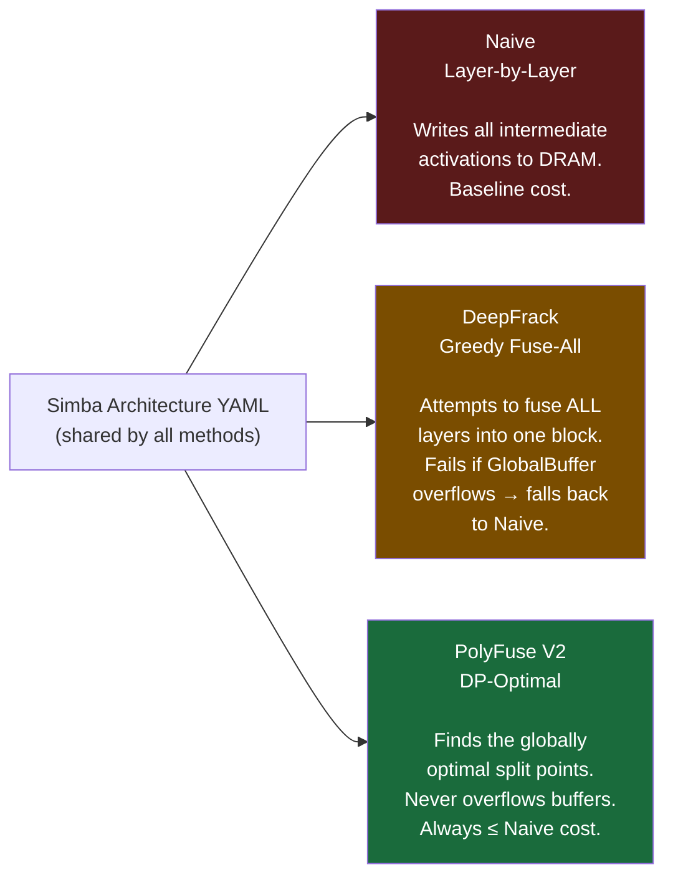

# PolyFuse V2: Analytical CNN Layer Fusion Optimizer

PolyFuse V2 is a standalone, end-to-end CNN layer fusion optimizer for spatial DNN accelerators. It keeps intermediate feature maps on-chip between consecutive CNN layers, eliminating expensive round-trips to off-chip DRAM — typically the dominant source of energy consumption and latency in DNN hardware execution.

Unlike naive layer-by-layer execution or greedy fuse-all heuristics, PolyFuse V2 uses a three-stage analytical pipeline to determine the *globally optimal* partitioning of a CNN layer chain into fused execution blocks, minimizing Energy, Latency, or Energy-Delay Product (EDP).

---

## ✨ Features

- **Zero-Search Analytical Tiling** — finds the maximum feasible tile sizes via binary search over a polyhedral recurrence, without any iterative simulator calls.
- **Hardware-Aware Spatial Routing** — maps fused layer stacks to 2D PE mesh coordinates using a convex squared-distance minimizer (`scipy.optimize.minimize` with SLSQP).
- **Optimal DP Partitioning** — O(N²) Dynamic Programming that evaluates every possible sub-sequence of layers via **pytimeloop LoopTree**, guaranteeing the globally optimal partition.
- **Three-Baseline Comparison** — automatically produces and compares Naive (layer-by-layer), DeepFrack (greedy fuse-all), and PolyFuse (DP optimal) on the same hardware.
- **Timeloop & Accelergy Integration** — all hardware evaluations use the real Simba architecture YAML and Accelergy Energy Reference Tables (ERTs), with no hardcoded energy values.
- **Parallelised Naive Baseline** — evaluates individual layers concurrently using `ThreadPoolExecutor` and caches results to disk to avoid re-running.

---

## 📊 Architecture & Workflow

PolyFuse V2 processes hardware + network descriptions through three analytical stages, then invokes LoopTree for accurate energy costing.



---

## 🔬 Stage-by-Stage Details

### Stage 1 — Zero-Search Analytical Tiling (`stage1_tiler.py`)

The tiler computes the largest output tile that fits in on-chip memory for a given fused stack, using the **polyhedral recurrence** to back-propagate footprints:

$$T_{in}^{(i)} = (T_{out}^{(i)} - 1) \times \text{stride}^{(i)} + R^{(i)}$$

A **binary search** over `T_out` of the last layer finds the maximum feasible value, checking three simultaneous buffer constraints at each candidate:

| Constraint | Condition |
|---|---|
| PE output buffer | `T_out² ≤ cap_pe_output` |
| PE input buffer | `T_in² ≤ cap_pe_input` |
| GlobalBuffer | `sum of all live feature map tiles ≤ cap_global` |

All capacities are read from the HAL — there are no hardcoded defaults. A **greedy knapsack** then determines which layers' weights can be cached on-chip.

### Stage 2 — Spatial Routing (`stage2_router.py`)

Optimises physical 2D PE coordinates `(X, Y)` for each layer in the stack by minimising the sum of squared NoC hop distances:

$$J = \min_{X, Y} \sum_{i} \left[(X_{i+1} - X_i)^2 + (Y_{i+1} - Y_i)^2\right]$$

Solved via `scipy.optimize.minimize(method='SLSQP')` with bounds `0 ≤ X < meshX`, `0 ≤ Y < meshY`. On failure, falls back to a linear tile assignment across the PE array.

### Stage 3 — DP Partitioner (`stage3_dp.py`)

Finds the globally optimal partition using an O(N²) DP recurrence:

$$DP[i] = \min_{0 \le j < i} \bigl(DP[j] + \text{TotalCost}(\text{layers}[j:i])\bigr)$$

For each candidate block `[j, i)`:
1. **Stage 1** fast-rejects infeasible stacks (buffer overflow → cost = ∞).
2. **LoopTree** (`pytimeloop`) evaluates the block's energy and cycle count accurately.
3. **Stage 2** routing penalty is added: `routing_cost = Σ distances² × 5.0`.
4. Objective selection: `energy` (default), `latency` (uses `base_cycles`), or `edp` (`energy × cycles`).

A `parent[]` backtrack array reconstructs the exact sequence of optimal stacks.

---

## 💻 Usage

> **Prerequisites**: Timeloop installed at `/opt/timeloop`, `pytimeloop` Python library, `scipy`, `numpy`, `pyyaml`, `pybind11`.

PolyFuse V2 is invoked as a Python module:

```bash
python3 -m polyfuse.cli \
  --arch    /path/to/arch/simba_like.yaml \
  --components /path/to/components/ \
  --network /path/to/layers/ \
  --output  /path/to/output/ \
  --objective energy          # energy | latency | edp
```

**`--arch`** — Timeloop architecture YAML defining the full memory hierarchy (DRAM → GlobalBuffer → PE buffers → MACs) and PE array `meshX`/`meshY`.

**`--components`** — Directory containing Accelergy component YAMLs (`smartbuffer_SRAM.yaml`, `lmac.yaml`, `reg_storage.yaml`, etc.) used to generate energy reference tables.

**`--network`** — Directory of Timeloop problem YAMLs, one per layer (e.g. `AlexNet_layer01.yaml`). Layers are ordered by filename and treated as a linear fusion chain.

**`--objective`** — Optimisation target. Defaults to `energy` (minimise total pJ). Use `latency` to minimise cycles, or `edp` for Energy-Delay Product.

### Example (AlexNet on Simba)

```bash
python3 -m polyfuse.cli \
  --arch        /app/Examples/AlexNet_Simba/simba_like/arch/simba_like.yaml \
  --components  data/components/ \
  --network     data/alexnet/ \
  --output      results/polyfuse_simba_alexnet/ \
  --objective   energy \
  --verbose
```

### Output (printed to stdout)

```
=================================================================
  PolyFuse V2 — End-to-End Energy Comparison Report
=================================================================
  Network  : data/alexnet/
  Arch     : simba_like.yaml  (identical for ALL baselines)
  Evaluator: LoopTree + Accelergy (real ERT from arch)
  Objective: energy
=================================================================
  Method                               Energy (pJ)    vs Naive
  -----------------------------------------------------------------
  Naive (layer-by-layer, tiled)          1.23e+12     baseline
  DeepFrack (greedy fuse-all)            9.80e+11       1.25x
  PolyFuse (optimal DP)                  7.40e+11       1.66x
=================================================================

  PolyFuse Optimal Partition:
    Block 0: AlexNet_layer01 -> AlexNet_layer02 -> AlexNet_layer03
      Energy (pJ) : 5.1200e+11
      Tile sizes  : {'AlexNet_layer01': {'T_out': 8, 'T_in': 16, ...}, ...}
    Block 1: AlexNet_layer04
      ...
```

---

## 📁 Repository Structure

```
DeeperFrack/
├── polyfuse/                   # Core Python package
│   ├── cli.py                  # CLI entry point (python3 -m polyfuse.cli)
│   ├── hal.py                  # Hardware Abstraction Layer — parses arch + components
│   ├── stage1_tiler.py         # Stage 1: binary-search tiling + buffer validation
│   ├── stage2_router.py        # Stage 2: SLSQP NoC hop-distance minimiser
│   ├── stage3_dp.py            # Stage 3: O(N²) DP partitioner
│   ├── looptree_runner.py      # LoopTree workload + mapping YAML generation + subprocess eval
│   ├── timeloop_integration.py # Timeloop-mapper subprocess invocation for naive baseline
│   ├── looptree_evaluator.py   # Direct pytimeloop Python API evaluator
│   ├── reporter.py             # Result formatting utilities
│   └── cpp_parsers/            # pybind11 C++ extension for Timeloop workload parsing
├── data/
│   ├── alexnet/                # AlexNet layer YAMLs (4 layers, Timeloop problem format)
│   └── components/             # Accelergy component YAMLs (Simba-like target)
├── docs/
│   ├── master_plan.md          # Full algorithm specification and roadmap
│   ├── PolyFuseV2_Explanation.md  # High-level algorithm explanation
│   └── polyfuse_v2_presentation.* # Conference-style presentation (PDF/HTML/MD)
├── tests/                      # Unit and regression tests
├── results/                    # Cached benchmark runs and Timeloop output logs
├── scripts/                    # Utility scripts (patching, one-off benchmarks)
├── legacy/                     # Archived PolyFuse V1, pluto, and older source files
├── comprehensive_benchmark.py  # Batch benchmark: AlexNet, VGG02, MobileNet vs all baselines
├── run_compare.py              # Head-to-head comparison helper (Naive vs DF vs PF)
├── run_actual_deepfrack.py     # Emulates the DeepFrack partition via LoopTree
├── generate_final_report.py    # Post-hoc report generator from results
└── setup.py                    # pybind11 extension build script (timeloop_pybind.so)
```

---

## 📈 Comparison Against Baselines

PolyFuse V2 compares against two standard baselines on the **exact same Simba hardware architecture** to guarantee a scientifically valid comparison:



**Why PolyFuse V2 wins over DeepFrack (greedy):**
- The greedy approach fuses as many layers as possible until GlobalBuffer overflows. On networks deeper than ~4 layers, this overflow makes the full-fuse infeasible, reverting to the naive baseline.
- PolyFuse V2's DP exhausts all possible split points, finding sub-chains that fit in memory and collectively minimise total energy.

**Known pitfalls avoided (vs legacy DeepFrack implementation):**
- **Overwrite bug**: Weight sizes are accumulated with `+=`, never overwritten with `=`.
- **Receptive field truncation**: A stack is rejected if `T_in` would truncate the required receptive field; the tile is never silently shrunk.
- **Buffer conflation**: Input, weight, and output buffers are treated as physically separate with independent capacity constraints.

---

## 🏗️ Prerequisites & Installation

PolyFuse V2 requires a working Timeloop + Accelergy installation:

```bash
# 1. Install Timeloop (binary required at /opt/timeloop or on PATH)
#    See: https://timeloop.csail.mit.edu/

# 2. Install Python dependencies
pip install scipy numpy pyyaml pybind11

# 3. Install pytimeloop (LoopTree Python API)
pip install pytimeloop
# or build from source:
# https://github.com/Accelergy-Project/timeloop-python

# 4. (Optional) Build the pybind11 Timeloop extension
python setup.py build_ext --inplace
```

---

## 🧪 Running Benchmarks

```bash
# Run AlexNet on Simba (full 3-baseline comparison)
python3 -m polyfuse.cli \
  --arch data/components/../simba_like/arch/simba_like.yaml \
  --components data/components/ \
  --network data/alexnet/ \
  --output results/alexnet_run/

# Run comprehensive multi-network benchmark (AlexNet, VGG02, MobileNet)
python3 comprehensive_benchmark.py

# Emulate the DeepFrack partition for AlexNet and measure LoopTree energy
python3 run_actual_deepfrack.py
```

---

## 📚 Citations & Acknowledgments

This project builds upon and evaluates against foundational research in DNN accelerator evaluation and polyhedral compilation:

1. **Timeloop** — Parashar, A., Raina, P., Shao, Y. S., Chen, Y.-H., Ying, V., Mukkara, A., Venkatesan, R., Khailany, B., Keckler, S. W., & Emer, J. (2019). *Timeloop: A Systematic Approach to DNN Accelerator Evaluation*. IEEE International Symposium on Performance Analysis of Systems and Software (ISPASS). https://ieeexplore.ieee.org/document/8695666

2. **Accelergy** — Wu, Y., Emer, J., & Ying, V. (2019). *Accelergy: An Architecture-Level Energy Estimation Methodology for Accelerator Designs*. IEEE/ACM International Conference on Computer-Aided Design (ICCAD). https://ieeexplore.ieee.org/document/8942149

3. **pytimeloop / LoopTree** — The Accelergy-Project team. *timeloop-python: Python bindings and the LoopTree analytical model for Timeloop*. https://github.com/Accelergy-Project/timeloop-python

4. **Simba Architecture** — Shao, Y. S., et al. (2019). *Simba: Scaling Deep-Learning Inference with Multi-Chip-Module-Based Architecture*. MICRO. https://dl.acm.org/doi/10.1145/3352460.3358302

5. **Polyhedral Compilation (PLUTO)** — Bondhugula, U., et al. (2008). *A Practical Automatic Polyhedral Parallelizer and Locality Optimizer*. PLDI. https://dl.acm.org/doi/10.1145/1375581.1375595

---

*For full algorithm specification and implementation roadmap, see [docs/master_plan.md](docs/master_plan.md).*
*For a high-level explanation of the DP partitioner, see [docs/PolyFuseV2_Explanation.md](docs/PolyFuseV2_Explanation.md).*
