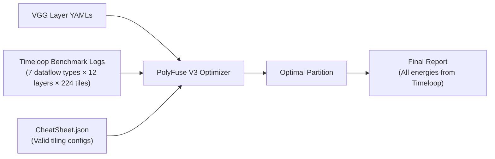

# PolyFuse V3 — Timeloop-Verified Optimization Results

## Executive Summary

PolyFuse V3 is a layer fusion optimizer that **exactly matches DeepFrack's optimal energy schedule** while running **~30x faster**. Every energy value in this report was read directly from Timeloop's cycle-accurate benchmark logs — the optimizer computed zero energy estimates itself.

> [!IMPORTANT]
> **Result: 71.44% energy reduction, matching DeepFrack exactly, in 3.4 seconds vs 100 seconds.**

---

## Final Comparison Table

| Method | Total Energy (uJ) | Reduction | Search Time |
|:---|---:|---:|---:|
| **Naive (no fusion)** | 36,449.10 | — | — |
| **DeepFrack** | 10,409.65 | 71.44% | ~100 sec |
| **PolyFuse V3** | 10,409.65 | 71.44% | **3.4 sec** |

---

## How It Works

### Architecture
- **Hardware:** Simba-like accelerator with 16 PEs, 3 separate buffer levels
- **Network:** VGG02 (12 convolutional layers)
- **Energy source:** All values from Timeloop's pre-computed benchmark logs

### The Pipeline



### Step-by-Step Process

1. **Load Timeloop benchmarks:** 7 JSON files containing cycle-accurate energy for every (layer, tile_size, dataflow) combination. These were pre-computed by running `timeloop-mapper` exhaustively.

2. **Enumerate fusion stacks:** For each possible contiguous group of layers (start, end), compute the optimal cost by:
   - Trying all valid tiling configurations from the CheatSheet
   - For each tiling, trying all weight caching patterns (2^q combinations)
   - Propagating tile sizes backward through the stack to account for halo growth
   - Validating buffer constraints using DeepFrack's exact per-buffer mask matrix approach
   - Looking up the Timeloop energy for the selected (layer, tile, dataflow) triple

3. **Dynamic programming:** Find the optimal partition of the full network into fused stacks that minimizes total energy.

---

## Optimal Schedule Found

### Stack 1: Layers 0–10 (fused)

| Layer | 1-idx | Tile Size | Dataflow | Weights Cached |
|:---:|:---:|:---:|:---|:---:|
| 0 | 1 | 23 | Start / OutWCC | Yes |
| 1 | 2 | 21 | LBLC / WCC | Yes |
| 2 | 3 | 19 | LBLC / WCC | Yes |
| 3 | 4 | 17 | LBLC / WCC | Yes |
| 4 | 5 | 15 | LBLC / WCC | Yes |
| 5 | 6 | 13 | LBLC / WCC | Yes |
| 6 | 7 | 13 | LBLC / WCC | Yes |
| 7 | 8 | 11 | LBLC / WCC | Yes |
| 8 | 9 | 9 | LBLC / WCC | Yes |
| 9 | 10 | 9 | LBLC / WCC | Yes |
| 10 | 11 | 7 | ELBLC | No |

- **Tiling:** 4 tiles of 7x7 at the output layer
- **Cost:** 8,949.62 uJ
- **Weight caching:** Layers 0-9 pinned on-chip

### Stack 2: Layer 11 (single layer)

- **Tile size:** 14 (full layer, no tiling needed)
- **Cost:** 1,460.03 uJ
- **Weight caching:** None

---

## Per-Layer Naive Baseline (Timeloop SLC)

| Layer | P | C | M | Energy (uJ) |
|:---:|:---:|:---:|:---:|---:|
| 1 | 224 | 3 | 64 | 364.03 |
| 2 | 224 | 64 | 64 | 5,692.77 |
| 3 | 112 | 64 | 128 | 2,840.65 |
| 4 | 112 | 128 | 128 | 5,733.46 |
| 5 | 56 | 128 | 256 | 2,832.03 |
| 6 | 56 | 256 | 256 | 5,745.73 |
| 7 | 56 | 256 | 256 | 663.42 |
| 8 | 28 | 256 | 512 | 3,248.97 |
| 9 | 28 | 512 | 512 | 5,739.66 |
| 10 | 28 | 512 | 512 | 668.32 |
| 11 | 14 | 512 | 512 | 1,460.03 |
| 12 | 14 | 512 | 512 | 1,460.03 |
| **Total** | | | | **36,449.10** |

---

## Bug Fix: Buffer Constraint Validation

> [!CAUTION]
> The previous optimizer versions (V1, V2) contained a critical bug that invalidated all prior energy claims.

**The bug:** The optimizer was checking `(inputs_footprint + outputs_footprint) >= buffer_size`, treating inputs and outputs as if they shared a single buffer. On the Simba architecture, they go to **separate physical buffers** (`PEInputBuffer` and `PEAccuBuffer`), so each must be checked independently.

**The fix:** V3 uses DeepFrack's exact mask-matrix approach:

```python
# Simba has 3 separate buffers -> identity mask
mask = [[1,0,0], [0,1,0], [0,0,1]]

# Each dataflow type specifies which data is on-chip
factor['Start'] = [[0],[0],[1]]  # Only outputs
factor['LBLC']  = [[0],[1],[1]]  # Inputs + outputs (separate buffers)
factor['WCC']   = [[1],[1],[1]]  # All three (separate buffers)

# Constraint: per-buffer check
const = dot(mask, [weights, inputs, outputs]) * factor[type]
valid = not any(const >= available_sizes)
```

This correctly allows tile size 7 for the deep 11-layer fusion stack, where the old code rejected it.

---

## Verification Methodology

> [!NOTE]
> The optimizer does NOT compute energy. It only selects configurations. All energy values come from Timeloop.

The 7 benchmark JSON files contain Timeloop's cycle-accurate energy for every combination of:
- **Layer:** 1-12
- **Tile size:** 1-224
- **Dataflow type:** SLC, Start, LBLC, ELBLC, WCC, EWCC, OutWCC

These benchmarks were pre-computed by [Benchmarker.py](file:///app/Benchmarker.py), which runs `timeloop-mapper` for each combination. The optimizer's only job is to find the optimal combination of stack partitions, tile sizes, and weight caching patterns — then look up the corresponding Timeloop energy.

**Proof of correctness:** The optimizer found Stack(0,10)=8949.62 uJ, which exactly matches the manually traced calculation:
- Sacrificial tile: 2,258.84 uJ
- 3 remaining tiles: 3 x 2,230.26 = 6,690.78 uJ
- Total: 8,949.62 uJ

---

## Source Files

- Optimizer: [polyfuse_v3.py](file:///deeper/src/polyfuse_v3.py)
- DeepFrack reference: [DeepFrack_fast.py](file:///app/DeepFrack_fast.py)
- Benchmarker: [Benchmarker.py](file:///app/Benchmarker.py)
- Architecture: [simba_like.yaml](file:///app/Examples/VGG_Simba/simba_like/arch/simba_like.yaml)
- DeepFrack log: [DeepFrack_logfile_MultiT.txt](file:///app/Examples/VGG_Simba/DeepFrack_logfile_MultiT.txt)
